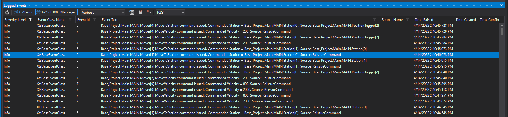

# Event Logger

!!! warning "Replaced by the Trace system"
    The per-object Event Logger has been replaced by the unified **Trace** system as of XTS Base v2.1. See [Trace](Trace.md) for current documentation on how to emit and configure diagnostic messages.

The image below shows the TwinCAT EventLog view, which is still the primary place to view trace output when `Param.ENABLE_TC_EVENT_LOGGER` is `TRUE`:

